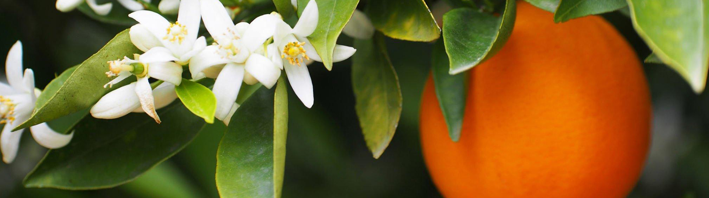

# Citrus Yield Prediction with Machine Learning

This repository contains the implementation of a precision agriculture project aimed at predicting citrus crop yields. The work was conducted in collaboration with **Les Domaines Agricoles**, a leading agricultural company in Morocco, using a dataset from over 100 regions and 500 citrus parcels (2020–2023).

## Project Overview

The objective of this project is to analyze crop yield factors and build robust machine learning models to predict monthly citrus yields using field measurements and accouting for challenges such as missing data and measurement inaccuracies.

---

## Features of the Project

- **Exploratory Data Analysis (EDA):**  
  Investigated a complex dataset of **200,000 records** to identify yield-influencing factors.  

- **Data Cleaning & Imputation:**  
  Addressed **50% missing values** in key features using advanced imputation techniques.  

- **Feature Engineering:**  
  Extracted meaningful features to enhance model performance.

- **Machine Learning Models Used:**  
  - Linear Regression  
  - Gradient Boosting Regression  
  - Random Forest Regression  
  - Stochastic Regression  

---
## Dataset Description

- **Source:** Citrus yield data from 100+ Moroccan regions (2020–2023).  
- **Size:** 200,000 records with 500 distinct parcels.  
- **Challenges:** Data integrity issues, including over 50% missing values in some features.  
